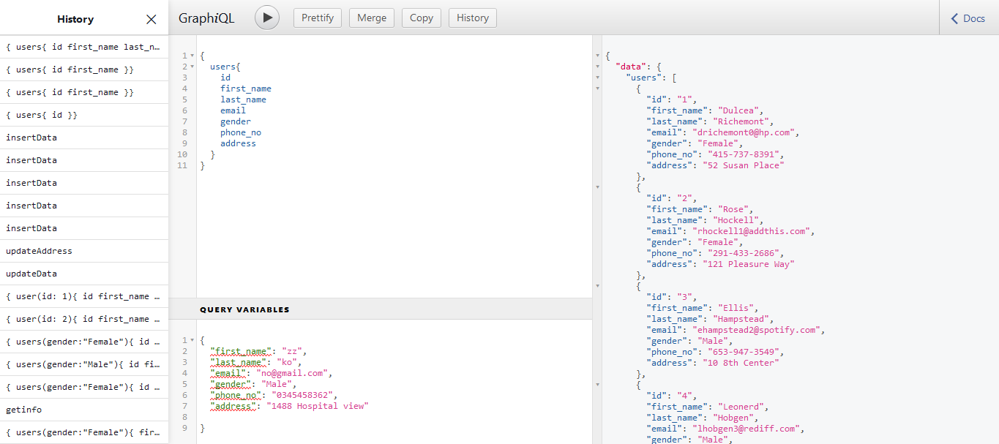

## GRAPHQL SEVER 



### Enviroment
### Make sure Node is installed

### colone repo then :

```
 npm install
```

### Run sever

```
npm run dev
```

Perfect :slightly_smiling_face:

[SEVER IS ON](localhost:5000/graphql?)
PORT 5000

localhost:5000/graphql?
